

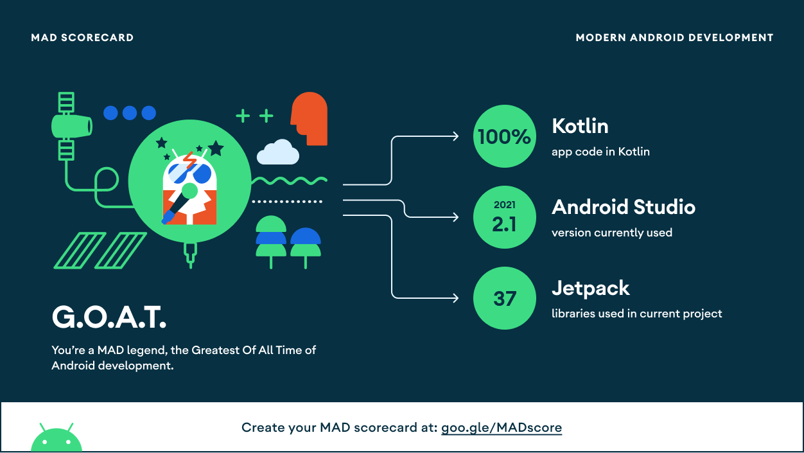

This sample showcases:

* Back button handling
* Text Input and focus management
* ONLINE/OFFLINE Status
* ACCEPTED/PENDING Friend request
* RECEIVED/READ Message status
* Block User
* Firebase Auth, Storage and Realtime Database
* Push Notification (need setup)
* Material Design 3 theming and Material You dynamic color
* UI tests

# ChatWithMe
MVVM Clean Architecture Instant chat messenger using firebase as backend service

### Material Design 3 theming and Material You dynamic color
Jetchat follows the [Material Design 3](https://m3.material.io) principles and uses the `MaterialTheme` composable and M3 components. On Android 12+ ChatWithMe supports Material You dynamic color, which extracts a custom color scheme from the device wallpaper. Jetchat uses a custom, branded color scheme as a fallback. It also implements custom typography using the Karla and Montserrat font families.

### Structural design pattern
The app is built with the Model-View-ViewModel (MVVM) is its structural design pattern that separates objects into three distinct groups:
- Models hold application data. They’re usually structs or simple classes.
- Views display visual elements and controls on the screen. They’re typically subclasses of UIView.
- View models transform model information into values that can be displayed on a view. They’re usually classes, so they can be passed around as references.

## Tech Stack.
- [Kotlin](https://developer.android.com/kotlin) - Kotlin is a programming language that can run on JVM. Google has announced Kotlin as one of its officially supported programming languages in Android Studio; and the Android community is migrating at a pace from Java to Kotlin.
- [Material 3](https://m3.material.io/foundations/accessible-design/overview) - Latest Material design for Android.
- Jetpack components:
    - [Jetpack Compose](https://developer.android.com/jetpack/compose) - Jetpack Compose is Android’s modern toolkit for building native UI. It simplifies and accelerates UI development on Android. Quickly bring your app to life with less code, powerful tools, and intuitive Kotlin APIs.
    - [Lifecycle](https://developer.android.com/topic/libraries/architecture/lifecycle) - Lifecycle-aware components perform actions in response to a change in the lifecycle status of another component, such as activities and fragments. These components help you produce better-organized, and often lighter-weight code, that is easier to maintain.
    - [ViewModel](https://developer.android.com/topic/libraries/architecture/viewmodel) -The ViewModel class is designed to store and manage UI-related data in a lifecycle conscious way.
    - [Kotlin-Flows](https://developer.android.com/kotlin/flow) - A flow is conceptually a stream of data that can be computed asynchronously.
    - [Paging 3 library](https://developer.android.com/topic/libraries/architecture/paging/v3-overview) - The Paging library helps you load and display pages of data from a larger dataset from local storage or over network. This approach allows your app to use both network bandwidth and system resources more efficiently.
    - [Data Store](https://developer.android.com/topic/libraries/architecture/datastore) - Jetpack DataStore is a data storage solution that allows you to store key-value pairs or typed objects with protocol buffers. DataStore uses Kotlin coroutines and Flow to store data asynchronously, consistently, and transactionally.
- [Kotlin Coroutines](https://developer.android.com/kotlin/coroutines) - A concurrency design pattern that you can use on Android to simplify code that executes asynchronously.
- [Dagger Hilt](https://developer.android.com/training/dependency-injection/hilt-android) - A dependency injection library for Android that reduces the boilerplate of doing manual dependency injection in your project.
- [Coil](https://coil-kt.github.io/coil/compose/)- An image loading library for Android backed by Kotlin Coroutines.
- [Firebae](https://firebase.google.com/)- Google Firebase is a Google-backed application development software that enables developers to develop iOS, Android and Web apps.
- [Timber](https://github.com/JakeWharton/timber)- A logger with a small, extensible API which provides utility on top of Android's normal Log class.

|            Profile Screen            |                User Screen                |                Chat Screen                |
| :----------------------------------: | :---------------------------------------: | :---------------------------------------: |
| 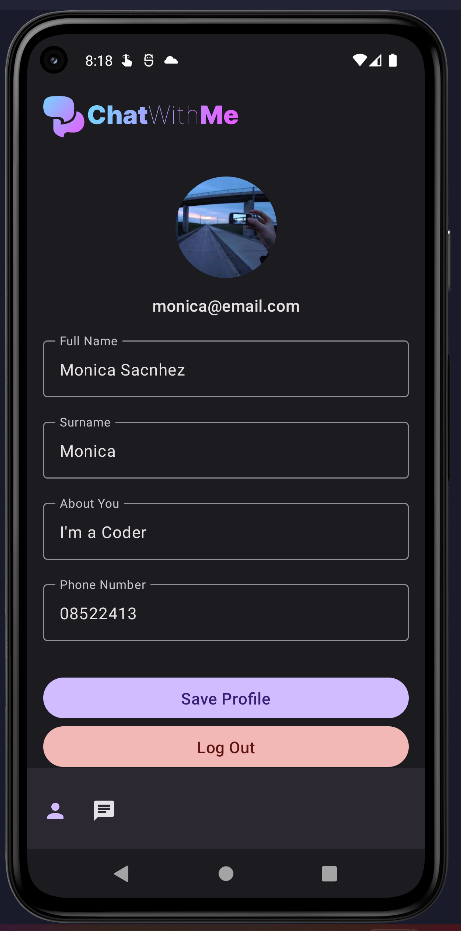  |      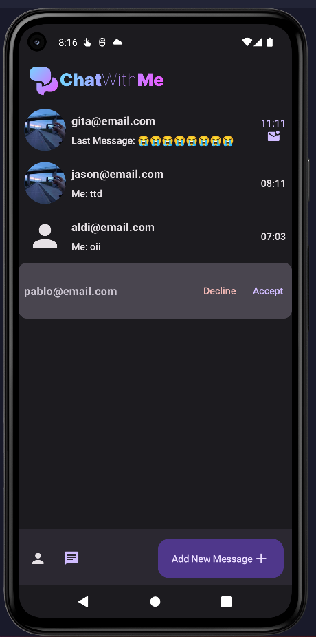      |      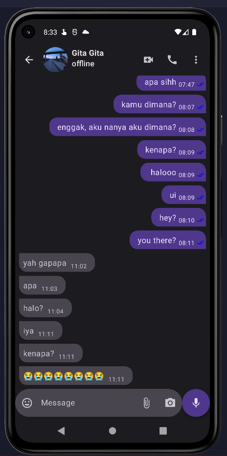      |

|              Auth Screen             |                 Add User                  |                
| :----------------------------------: | :---------------------------------------: | 
|   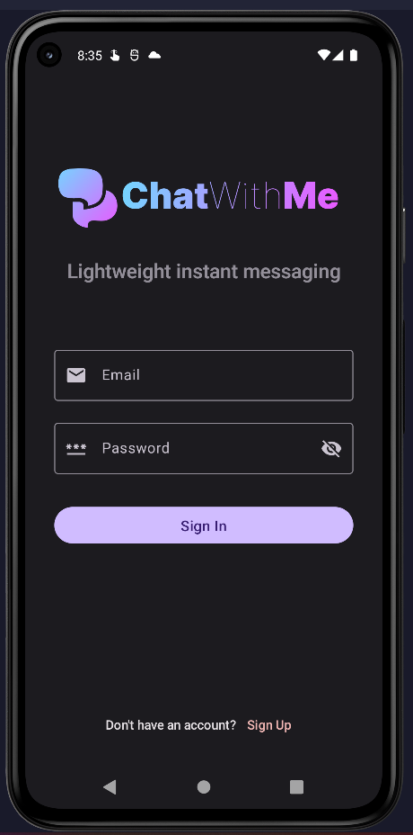    |       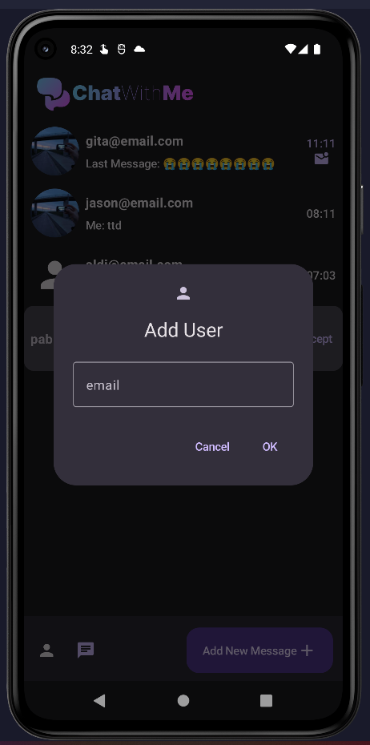        |        

|         Profile Screen Light         |             User Screen Light             |             Chat Screen Light             |
| :----------------------------------: | :---------------------------------------: | :---------------------------------------: |
| 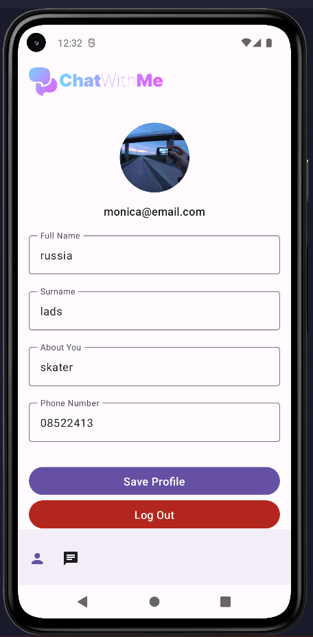 |     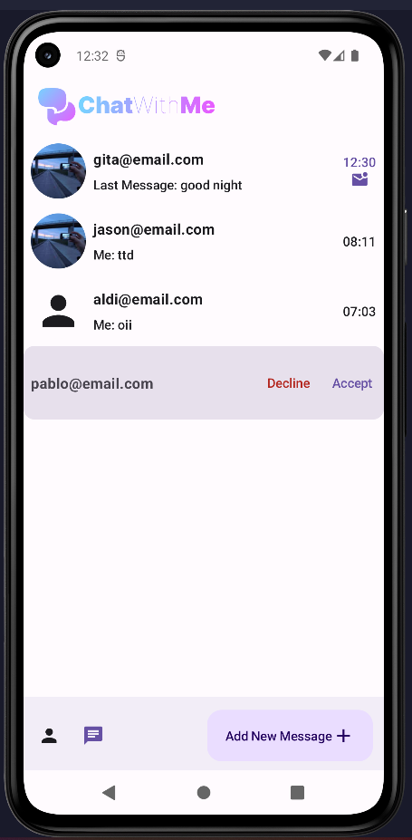      |      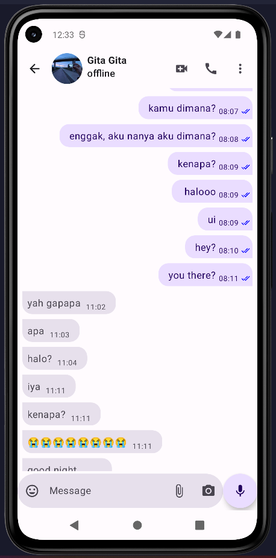     |
    

|     User Screen Dynamic + Light      |        User Screen Dynamic + Dark         |
| :----------------------------------: | :---------------------------------------: | 
|  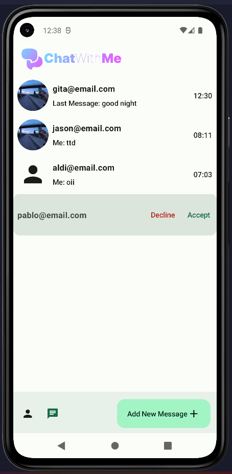   |     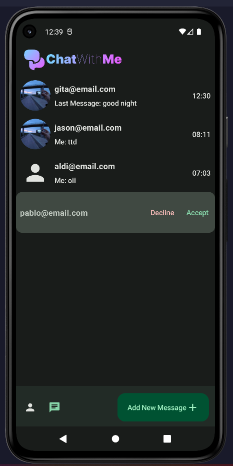     |      

|      Chat Screen Dynamic + Light     |        Chat Screen Dynamic + Dark         |
| :----------------------------------: | :---------------------------------------: | 
|  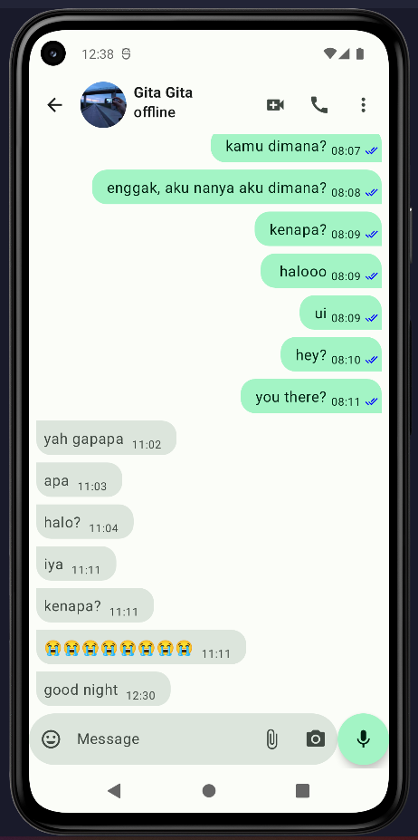   |     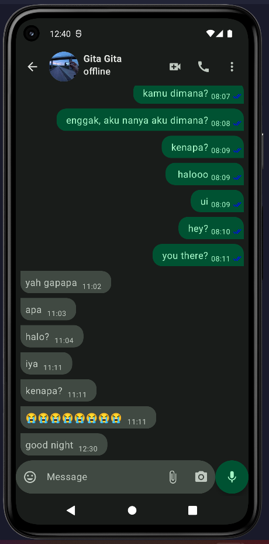     |     

